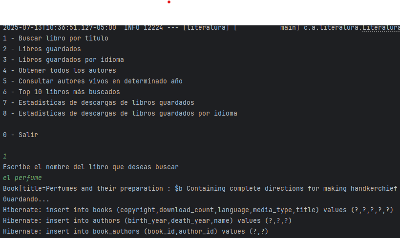
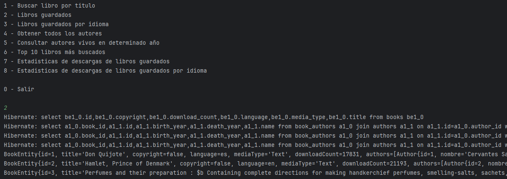
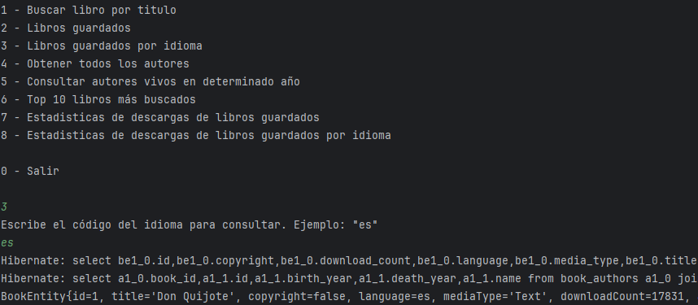
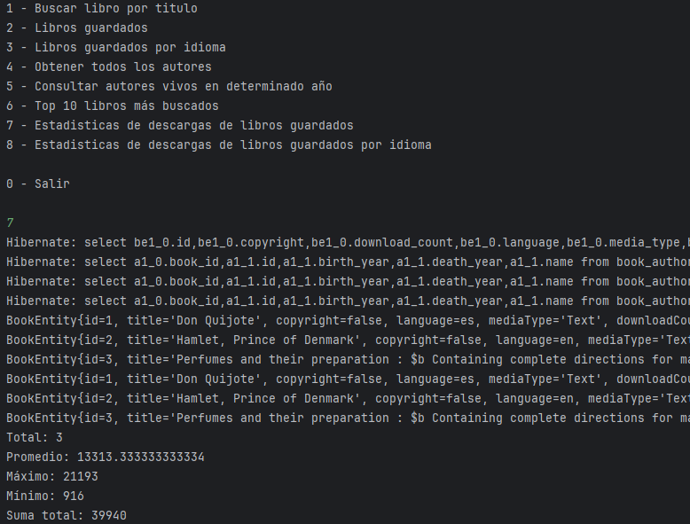

# Literalura

**Literalura** es una aplicación Java desarrollada con Spring Boot que permite consultar y persistir información de libros del proyecto [Gutenberg](https://gutendex.com/), incluyendo autores, títulos, tipos de medios y consultar estadísticas de descargas.

## 💠 Tecnologías utilizadas

* Java 17+
* Spring Boot
* Spring Data JPA
* PostgreSQL
* Hibernate
* Maven

## Funcionalidades

* Consulta de libros desde la API de Gutendex.


* Persistencia de libros y autores en base de datos.


* Filtros por idioma, autor o año.


* Estadísticas con Java Streams:



## 📌 Cómo ejecutar

1. Clona el repositorio:

```bash
git clone https://github.com/tu-usuario/literalura.git
cd literalura
```

2. Ejecuta la aplicación en IntelliJ IDEA:


3. La lógica principal se ejecuta en la clase `Principal.java`.

Desarrollado por Margarita Sorzano
